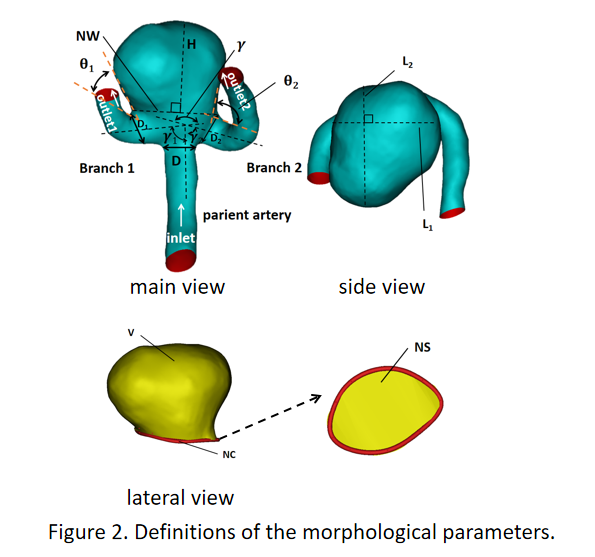
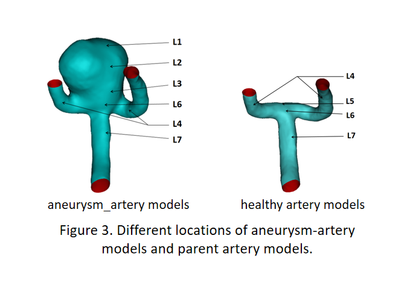
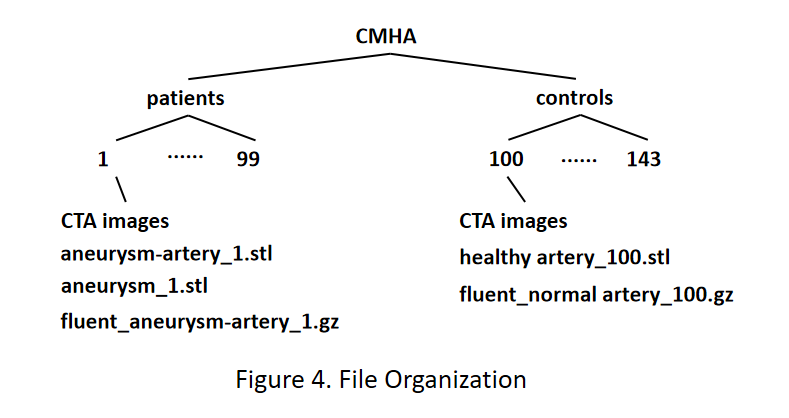

# CMHA:
)

We have constructed an open-access 3D middle cerebral artery aneurysm dataset,  which covers raw CTA imaging data, 3D model data (i.e., aneurysm_artery models, aneurysm models and healthy control models), and hemodynamic simulation result. 

What's more, based on the models, we have conducted detailed analysis of the aneurysms, documenting clinical information, morphological characteristics, and hemodynamic data of the patients. These data are saved in an excel table named results.

The dataset could be download [here] ([https://1drv.ms/f/s!AgOoTZIVYfRffHwI1nTzYJy-PI8?e=SYIrqI](https://1drv.ms/f/s!AgOoTZIVYfRfatZ23-ISSuQ3ijw?e=aeNg45)https://1drv.ms/f/s!AgOoTZIVYfRfatZ23-ISSuQ3ijw?e=aeNg45).

## Subjects

99 patients with 105 MCA aneurysms (77 ruptured and 28 unruptured) and 44 normal healthy controls were included into the database.

## Morphological Parameters

15 morphological parameters (refer to Figure below) were measured based on the 3D surface model using the "spline" and "measure" tools within Mimics. These parameters consist of:

  ● 3 vascular diameters: the aortic diameter ($D$), the thicker branch diameter ($D_{1}$), and the smaller branch diameter ($D_{2}$).

  ● 5 bifurcation angles: these encompass angles between the aneurysm and the two branches ($\theta_{1}$, $\theta_{2}$), the vessel angle between the two branches ($\gamma$), and angles between the aorta and the two branches ($\gamma_{1}$, $\gamma_{2}$).

  ● 9 size variables, comprising 7 primary size variables: aneurysm perpendicular height ($H$), neck width ($NW$), maximum length of the aneurysm ($L_{1}$), maximum width of the aneurysm ($L_{2}$), neck circumference ($NC$), neck cross-sectional area ($NS$), and aneurysm volume ($V$); Additionally, three derived parameters include Aspect Ratio ($AR$), calculated as H/NW following Ujiie\cite{ujiie2001aspect} and Dhar\cite{dhar2008morphology}, Size Ratio ($SR$) defined as H / (($D$ + $D_{1}$ + $D_{2}$) / 3) .

## Hemodynamic Parameters
We computed a total of 18 hemodynamic parameters across three categories from the simulated flow fields.

  ● The first category comprises 7 flow- and velocity-related parameters: inlet mass flow rate ($kg\cdot s^{-1}$), two outlet mass flow rates ($kg\cdot s^{-1}$), two outlet mass flow ratios, maximum velocity ($m\cdot s^{-1}$), and mean velocity ($m\cdot s^{-1}$).

  ● The second category encompasses 6 mean pressure and shear stress parameters: Mean wall pressure (Pa), mean internal pressure (Pa), mean wall shear stress (Pa), mean wall pressure gradient ($kg\cdot m^{-2}\cdot s^{-2}$), mean internal pressure gradient ($kg\cdot m^{-2}\cdot s^{-2}$), and mean wall shear stress gradient ($kg\cdot m^{-2}\cdot s^{-2}$).

  ● Additionally, we collected 5 parameters related to extreme values and their respective locations (See Figure below} for the location demonstration of aneurysm). They are the maximum WSS, Max wall pressure (Pa), max WSS (Pa), min WSS (Pa), max wall pressure gradient ($kg\cdot m^{-2}\cdot s^{-2}$), max WSS gradient ($kg\cdot m^{-2}\cdot s^{-2}$), along with their corresponding positions. These parameters are important for capturing extreme flow dynamics and play a critical role in predicting development and rupture of aneurysm.

## Data Organization

All 99 patients and 44 healthy controls were organized in a standardized manner, following a consistent naming and directory structure (See figure below ). For each patient, we included the raw CTA images, the 3D models, and the hemodynamic models and analysis results of the aneurysm, and aneurysm\_artery models in the database. For each healthy control, only the raw images and models of the healthy artery models are included. To facilitate future researches, we summarized the complete clinical data, morphological and hemodynamic parameters, and their statistical descriptions for all subjects in an separate Excel spreadsheet, which is located in the CMHA directory. 

The clinical, morphological, and hemodynamic parameter values for each case were aggregated in the "Results" Excel spreadsheet. The spreadsheet is divided into four categories, with 7 unique sheets, including one for clinical data, two for morphological parameters (aneurysm\_artery for patients and parent artery for healthy controls), two for hemodynamic parameters (aneurysm\_artery for healthy controls, parent artery for healthy controls), and two for location information parameters (aneurysm\_artery for healthy controls, parent artery for healthy controls). Every row in the tables corresponds to a specific case's information category.

## Paper

Please cite our paper if you use it.
